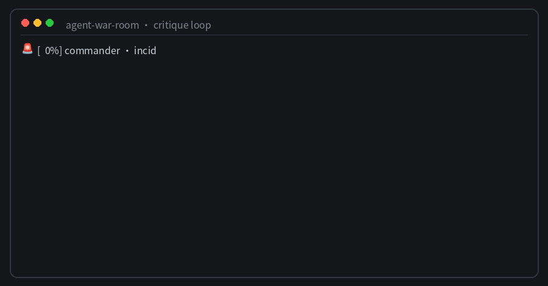

# Agent War Room

Reference implementation for the COSCUP 2026 talk:



> 四個 Agents 如何一起抓 Bug？GEAP × ADK × Antigravity × OpenAB 實戰

The project demonstrates a visible, verifiable multi-agent incident-response
workflow:

- **OpenAB** provides the Discord entry point and thread-based delivery.
- **ADK** orchestrates the Incident Commander, Triage, and Evidence Critic.
- **Antigravity** performs open-ended investigation in a managed sandbox.
- **GEAP** provides managed runtime, sessions, interactions, and observability.

## Repository status

This repository is an early experiment. The first executable spike is the
public-event projector: it converts raw ADK/Antigravity events into a stable,
safe event stream suitable for Discord without exposing private model
reasoning.

```bash
npm test
npm run demo
```

## Layout

```text
incident-lab/          Reproducible fault scenarios and ground truth
adk-war-room/          ADK orchestration application
antigravity-agent/     Managed Agent configuration and debugging skill
openab-adapter/        Case-specific ACP/Discord integration
experiments/           Executable technical spikes
docs/                  Specification and architecture
```

## Publication boundary

The repository contains a teaching-oriented reference implementation. It does
not include production credentials, customer data, proprietary consulting
runbooks, internal risk policies, or production OpenAB configuration.

## Licensing plan

- Code and reusable examples: Apache-2.0
- Talk materials and diagrams: CC BY 4.0
